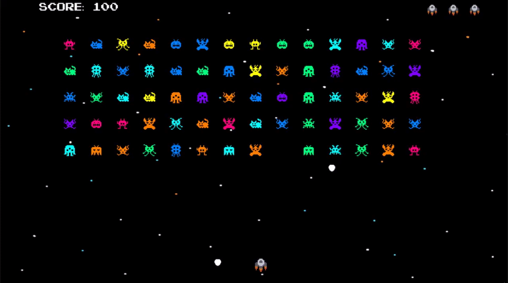

# **Magge**
By August Lewén and Mandel Cohen




## Project description
Our assignment was to create a simple game using SDL and further develop our skills in C++, Object Oriented Programming and using Design Patterns over a period of 1 - 2 weeks. We chose to re-make the classic arcade game **Space Invaders**, keeping the original look and mechanics, but adding our own twist to it. 

## Cute features we added
* Hand drawn pixel art - Spaceship and monsters.
* Randomizing the monsters texture and color when spawning, and the color of the players projectiles.
* Slight freeze frame when player takes damage.
* Free sound effects to tie it all togehter.
* Start Screen with credits, Win Screen and Game Over screens with option to "Press R to restart".

## Troubles we encountered
* Weird player and monster movement (Solved by capping frame rate using a timer). Also had some bugs regarding input, like shooting and moving at the same time.
* Library Dependencies (Solved by moving all ```.dll``` files toghether). Setting up all SDL libraries (SDL2, SDL2_IMAGE, SDL2_TTF, SDL2_MIXER) and adding the correct "Environment varaiables" was a bit of a struggle.
* Circular dependencies (Solved by forward declarations and file management). This is by far the most confusing aspect of learning C++. We're still not sure we understand it. 
* Include-explosions (Move definitions to .cpp file). 


## One Class we’re particularly happy about
Pick one.. 
```
//here is our amazing class
```


## Design Patterns we used
*  **Object Pooling** (used for enemies, projectiles and bombs)
*  **Update Method** (for rendering all active game objects in sceene)


## STD Classes we used
*  Using std::vector for all pools mentioned above. 
*  std::string to load paths for .png textures and store in an array to randomise monster texture.


## Conclusion
 Bla bla bla.. Happy happy bla.
